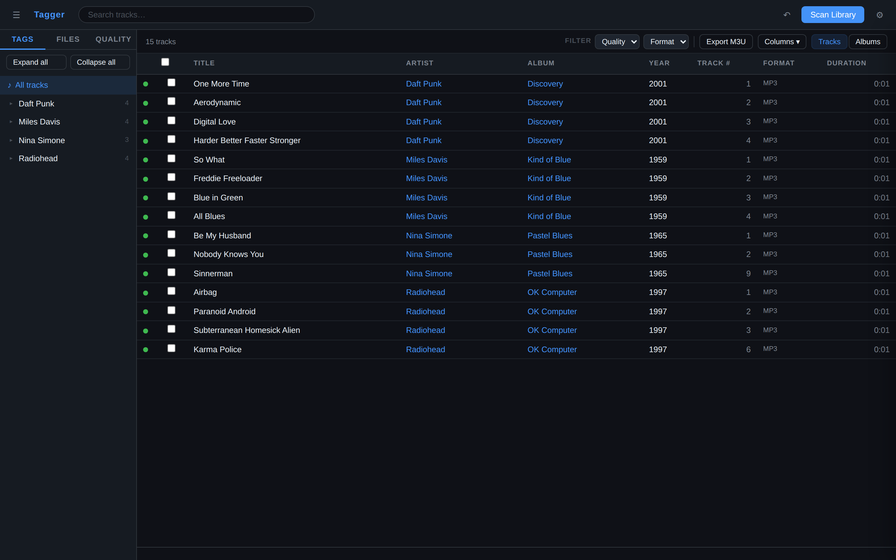
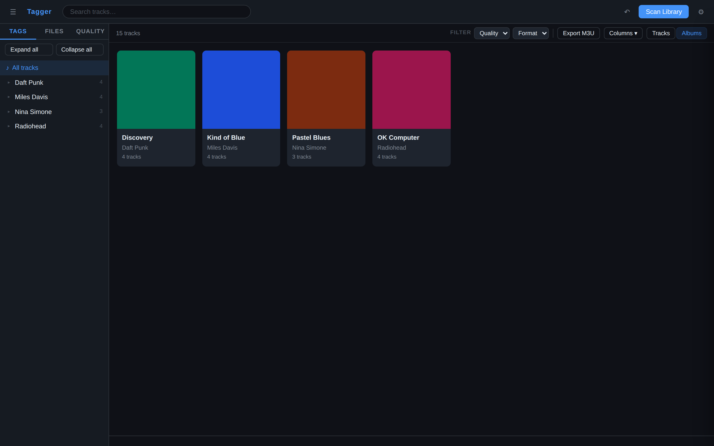
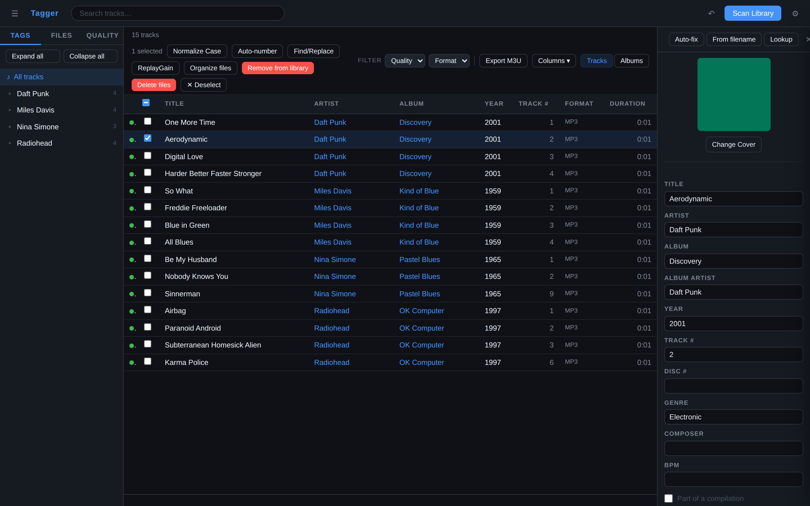

```
   __
  / /_____ _____ _____ ____  _____
 / __/ __ `/ __ `/ __ `/ _ \/ ___/
/ /_/ /_/ / /_/ / /_/ /  __/ /
\__/\__,_/\__, /\__, /\___/_/
         /____//____/
```

Self-hosted web app for editing audio tags (FLAC, MP3, AAC/M4A, OGG) — run it
on a NAS or server and tag your library from any browser.

[](https://github.com/rnhinson/tagger/actions/workflows/ci.yml)
[](https://github.com/rnhinson/tagger/actions/workflows/publish.yml)
[](LICENSE)

## Quick start

### Docker Compose

```bash
git clone https://github.com/rnhinson/tagger.git && cd tagger
# In docker-compose.yml, set your library path on the left of ":/music"
docker compose up -d
# → http://localhost:8000
```

### Docker CLI

```bash
docker run -d -p 8000:8000 \
  -v /your/music:/music \
  -v tagger-config:/config \
  ghcr.io/rnhinson/tagger:latest
# → http://localhost:8000
```

Multi-arch images (`amd64` + `arm64`) are published to GHCR on each release.
See the [self-hosting guide](docs/SELF-HOSTING.md) for HTTPS, reverse-proxy,
health-check, and backup notes.

## Screenshots

| Track list | Album grid | Tag editor |
|:---:|:---:|:---:|
|  |  |  |

## Features

- **Library** — scan into a searchable SQLite index; browse by artist/album,
  folder, or data-quality issue; full-text search.
- **Editing** — all common tags (incl. composer, BPM, lyrics, compilation),
  solo or in bulk; auto-number, find/replace, case normalization; embedded
  cover art (view / upload / fetch from the Cover Art Archive).
- **Metadata lookup** — MusicBrainz (with an edition picker), AcoustID
  fingerprinting, and Discogs; one-click Auto-fix and filename inference.
- **Files** — template-based rename/reorganize, `.m3u` export, ReplayGain, and
  a recoverable trash — all undoable.
- **Quality** — a panel for missing tags, duplicates, and dead files, with a
  "keep best quality" de-duplicator and bitrate/sample-rate columns.
- **Playback** — inline, seekable audio right in the tag editor.
- **Ops** — optional rate-limited password auth, `/api/health`, a responsive
  UI, and keyboard shortcuts (press `?`).

## Configuration

| Variable            | Default    | Description                              |
|---------------------|------------|------------------------------------------|
| `TAGGER_MUSIC_DIR`  | `/music`   | Root of your music library               |
| `TAGGER_CONFIG_DIR` | `/config`  | Where `library.db` + `settings.json` live |
| `TAGGER_PASSWORD`   | *(unset)*  | If set, requires a login                 |
| `TAGGER_SECURE_COOKIE` | *(unset)* | Mark the session cookie `Secure` (HTTPS) |
| `ACOUSTID_API_KEY`  | *(unset)*  | Enables AcoustID fingerprint lookup      |
| `TAGGER_LOG_LEVEL`  | `INFO`     | Log verbosity                            |

The AcoustID key and a Discogs token can also be set at runtime in **Settings**.
Auth is off unless `TAGGER_PASSWORD` is set; ReplayGain uses `rsgain` (bundled
in the image) or `loudgain` when present. Full details, including HTTPS setup,
are in the [self-hosting guide](docs/SELF-HOSTING.md).

## Development

Requires Python 3.11+ and Node 18+.

```bash
export TAGGER_MUSIC_DIR=~/Music   # optional
./dev.sh                          # backend :8000 + Vite dev server :5173
```

Run the checks CI runs: `cd backend && pytest`, and
`cd frontend && npx tsc --noEmit && npm run build`. See
[CONTRIBUTING.md](CONTRIBUTING.md) for project layout and conventions.

## License

[MIT](LICENSE).
